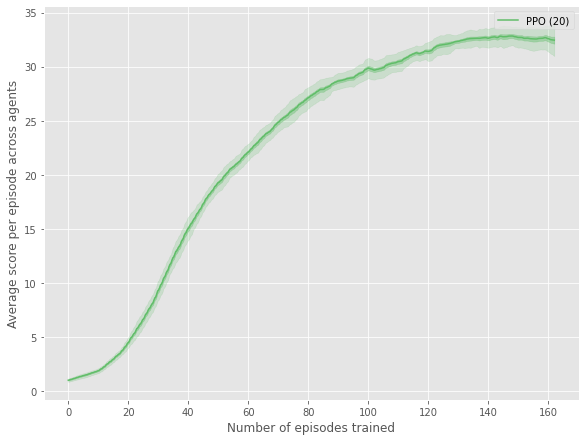

# Report

## Learning Algorithm
We implement the PPO algorithm (_Schulman et al., 2017_) to solve the Udacity version of the Unity Reacher
environment. PPO is from a family of policy gradient methods for reinforcement learning. The approach involves
alternating between collecting experiences from the environment, and optimizing a "surrogate" objective
function using stochastic gradient ascent.

The pseudocode for the algorithm that has been implemented is shown below.

[Source](https://spinningup.openai.com/en/latest/algorithms/ppo.html#pseudocode)

The following sections describes the implementation in more detail and the results from the experiment.

### Model architecture
We use separate actor and critic networks (similar architecture except output layers;
separate fully connected layers) to estimate both a value function V(s) and a policy π(s).
The exact architecture used for the neural network is as follows.

The input to both neural networks has 33 dimensions corresponding to position, rotation, velocity,
and angular velocities of the arm. The first hidden layer is fully-connected and
consists of 64 Tanh activation units. The second hidden layer is also fully-connected and consists of
64 Tanh activation units.

The output layer for the critic network is a fully-connected linear layer
with a single output unit that yields the value estimate for a given state. The output layer for the
actor network is a fully-connected linear layer which gives the mean of a normal distribution for each of
the four action dimensions. We sample the action with this mean and standard deviation that is
encoded as a learnable scalar.

We implement the PPO-Clip loss as outlined
[here](https://spinningup.openai.com/en/latest/algorithms/ppo.html?highlight=PPO#key-equations).

Reproducing the equation for the loss for ease of reference (this loss function is the core of PPO):

where,

The advantage is calculated using the Generalized Advantage Estimation approach as outlined
in _Schulman et al. 2015_.

The value loss is simply the mean squared error with the reward to go set as the label.

### Training details

The 20 robotic arm environment is used for distributed training. The training data is collected
in parallel by interacting with all 20 robotic arms. A single agent is used to interact with all
the arms for 250 time steps, and the sampled experiences is used to calculate the loss
for the actor and critic network as described above. Using this data the network weights are updated
using the Adam algorithm with mini-batches of size 64 and 10 optimization epochs.

The values and description of all the hyper-parameters are provided in the table below.

**Table:** List of hyper-parameters and their values

Hyperparameter | Value | Description
------------ | ------------- | -------------
gamma | 0.99 | Discount factor used for PPO update
lam | 0.95 | Extra discount factor for reducing the variance as described in the GAE paper
ppo_epsilon | 0.1 | Clamp importance weights between 1-epsilon and 1+epsilon
update_epochs | 10 | Number of optimization epochs to run when updating (for PPO)
update_freq | 250 | Number of env steps between updates (aka rollout length)
learning_rate | 2e-4 | Learning rate for the actor critic network
ppo_batch_size | 64 | Batch size (number of trajectories) used for PPO updates
gradient_clip | 0.75 | Clip gradient norm at this value

The values of all the hyper-parameters were picked based on an informal assessment of
performance and is likely not the optimal set of parameters.

The training was very sensitive to the hyper-parameters and the agent would not make any progress in its task.
We had to use the following tricks to get the network to learn:
* normalize the input (states) to the network
* initialize the weights with a (semi) orthogonal matrix, as described in _Saxe, A. et al. (2013)_.
* clip the gradient norm at 0.75

With these modifications, the agent exhibited stable learning pattern. In the next section, we discuss
the results of the experiment.

### Evaluation procedure
The key evaluation metric that is tracked is the average reward across the 20 robotic arms collected by the agent
over 100 episodes. The environment is considered solved when the agent gets an average score of +30 over 100
consecutive episodes. We expect this metric to keep increasing with more training episodes.

### Results
The plot below shows the training curves tracking the agent’s average score. We use a slightly modified version of
the [plotting approach](https://github.com/openai/baselines/blob/master/docs/viz/viz.ipynb) from the `baselines`
library to succinctly show results of the multiple worker scores.

Each point is the average (smoothed) score achieved per episode after the agent is run. The smoothing is performed
over a 10 episode smoothing window. The lighter shade around the scores line shows the standard deviation of data,
and darker shade - error in estimate of the mean (i.e. standard deviation divided by square root of number of workers).

We make the following observations from the plot:
* The training of the PPO agent is stable as illustrated by the increasing average score over the training timeline
* The agent is able to reach a score 30.04 (> the target average score of 30) in 163 episodes.

## Ideas for future work
* We did not perform a systematic hyper-parameter tuning exercise to arrive at an optimal set of hyper-parameter. While
the computational cost may be high for a comprehensive parameter sweep, it is very likely that we can train better
agents when using more tuned parameters.
* We have only implemented one algorithm here. It would be interesting to compare other approaches that have shown
  promise for continuous control such as DDPG (_Timothy et al. 2015_) and Soft Actor-Critic (_Haarnoja et al. 2018_).

## Code availability.
The source code can be accessed at https://github.com/nsriram13/rl-continuous-control.

## References
* Haarnoja, Tuomas, et al. Soft Actor-Critic: Off-Policy Maximum Entropy Deep Reinforcement Learning with a Stochastic Actor. Jan. 2018. arxiv.org, https://arxiv.org/abs/1801.01290v2.
* Lillicrap, Timothy P., et al. Continuous Control with Deep Reinforcement Learning. Sept. 2015. arxiv.org, https://arxiv.org/abs/1509.02971v6.
* Saxe, Andrew M., et al. Exact Solutions to the Nonlinear Dynamics of Learning in Deep Linear Neural Networks. Dec. 2013. arxiv.org, https://arxiv.org/abs/1312.6120v3.
* Schulman, John, Philipp Moritz, et al. High-Dimensional Continuous Control Using Generalized Advantage Estimation. June 2015. arxiv.org, https://arxiv.org/abs/1506.02438v6.
* Schulman, John, Filip Wolski, et al. Proximal Policy Optimization Algorithms. July 2017. arxiv.org, https://arxiv.org/abs/1707.06347v2.
